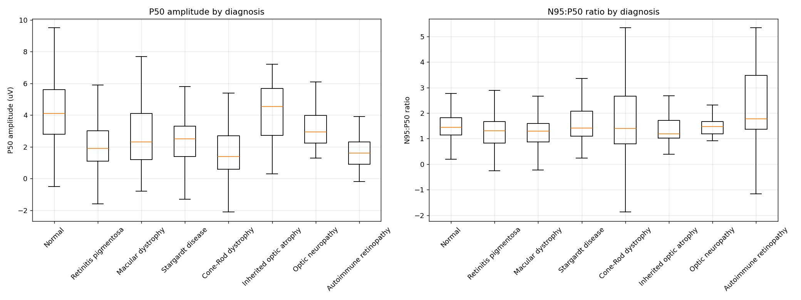

# PERG波形自動解析：N35・P50・N95検出パイプライン

パターン網膜電図（PERG）の波形データから、臨床的に重要な3つの成分（N35・P50・N95）を自動検出し、
振幅・潜時を算出するPythonパイプラインです。

## 1. 概要

- 公開データセット（PERG-IOBA Dataset）に含まれる1354件のPERG波形すべてに適用可能
- ISCEV（国際臨床視覚電気生理学会）標準に準拠した特徴量（P50潜時・P50振幅・N95振幅・N95:P50比など）を算出
- 検出結果は必ずQC画像（生波形＋検出位置のマーカー）として出力され、目視で確認できる

## 2. 背景・目的

このプロジェクトは、機械学習エンジニア・データサイエンティストを目指す個人の学習・ポートフォリオ用途として作成しました。
「未知のドメイン（眼科電気生理学）に対して、臨床標準を調査した上で特徴量を設計し、検出結果を統計的に検証する」という、
実務に近いプロセスを一通り経験することを目的としています。

## 3. 使用データセット

**PERG-IOBA Dataset**（PhysioNet）

- 304名・336記録・1354件のPattern ERG（PERG）信号
- 年齢・性別・診断名（`diagnosis1`〜`diagnosis3`）・視力（logMAR）付き
- ライセンス：Open Data Commons Attribution License v1.0（出典明記で自由に使用・改変・再配布可）
- 収録機関：Institute of Applied Ophthalmobiology (IOBA), University of Valladolid, Spain

データ本体：https://physionet.org/content/perg-ioba-dataset/1.0.0/

引用：

```
Fernández, I., Cuadrado Asensio, R., Larriba, Y., Rueda, C., & Coco Martín, R. M. (2024).
A Comprehensive Dataset of Pattern Electroretinograms for Ocular Electrophysiology Research:
The PERG-IOBA Dataset (version 1.0.0). PhysioNet. https://doi.org/10.13026/d24m-w054
```

データセットを紹介する論文（Scientific Data誌）：
https://www.nature.com/articles/s41597-024-03857-1

このリポジトリにはデータそのものは含まれていません。上記リンクからダウンロードし、
`input/`フォルダに配置して使用してください（配置方法は「6. セットアップ・実行方法」参照）。

## 4. 抽出する特徴量

ISCEV標準（PERGの国際臨床基準）に準拠し、以下の項目を算出します。

| 項目 | 定義 | 備考 |
|---|---|---|
| P50潜時 | 刺激反転開始からP50頂点までの時間 | 必須項目 |
| P50振幅 | N35の谷からP50の頂点までの高さ | 必須項目。N35が不明瞭な場合はベースラインで代用 |
| N95振幅 | P50の頂点からN95の谷までの高さ | 必須項目 |
| N95潜時 | 刺激反転開始からN95谷までの時間 | 参考項目（N95頂点は幅広く測定精度が低いため） |
| N95:P50比 | N95振幅 / P50振幅 | 内層網膜（神経節細胞）と外層網膜（光受容体）の機能バランスの指標 |

参照：Bach, M. et al. ISCEV standard for clinical pattern electroretinography (PERG): 2012 update.
Doc Ophthalmol 126(1):1-7 (2013).

## 5. アルゴリズムの設計

PERGの正常波形は「N35（初期の小さな陰性）→ P50（大きな陽性）→ N95（大きな陰性）」という、
一続きの屈曲パターンを持ちます。このパターンを検出するため、以下の方式を採用しています。

1. 波形全体から、本物らしき極値（周囲より十分高い/低い点。ノイズを避けるためプロミネンスで足切り）を検出する
2. その中から、N35（陰性）→P50（陽性）→N95（陰性）という順序・極性の制約を満たす組み合わせを選ぶ
3. 妥当な極値が見つからない場合は「検出不能」としてフラグを立てる

固定の探索窓の中の最大値/最小値を機械的に返す単純な方式も検討しましたが、
波形が平坦・ノイズのみの場合に意味のない値を返してしまう問題があったため、この方式にしています。

より高度な信号処理（離散ウェーブレット変換、統計的モデリングなど）を使った先行研究もありますが、
本プロジェクトでは「全体波形から極値を検出し、順序で絞り込む」という、比較的シンプルな方式を採用しています。

### 検出不能・信頼度低の扱い

- `response_detected = False`：妥当な時間範囲に、本物らしきP50のピークが一つも見つからなかった場合
- `low_confidence = True`：P50振幅がISCEV正常範囲下限の半分（1.0μV）を下回る場合。
  CSVの数値が0.1μV刻みに丸められていることに由来する量子化ノイズを、本物のピークとして
  誤検出している可能性がある症例にフラグを立てる

## 6. セットアップ・実行方法

```bash
# 0. このリポジトリを手元に取得する
# gitに慣れている場合：
git clone <このリポジトリのURL>
cd <リポジトリ名>
# gitを使わない場合：GitHubのリポジトリページ右上の緑色の「Code」ボタン→
# 「Download ZIP」でダウンロードし、展開してできたフォルダに移動する

# 1. 仮想環境を作成して有効化
python3 -m venv venv
source venv/bin/activate        # Windowsの場合: venv\Scripts\activate

# 2. 依存パッケージをインストール
pip install -r requirements.txt

# 3. input フォルダを作り、波形CSVとparticipants_info.csvを配置
mkdir input
# PERG-IOBA DatasetのZIPを展開し、csvフォルダの中身をinput/にコピー

# 4. 実行（1354件を処理するため、数分程度かかります）
python3 detect_perg_waves.py
```

実行すると、`qc_images/`フォルダにQC画像（1チャンネルにつき1枚）、
`perg_detection_result.csv`に検出結果の一覧が出力されます。

コマンドライン引数で入出力先を変更することも可能です。

```bash
python3 detect_perg_waves.py --input data/normal_only --output qc_normal --result-csv normal_result.csv
```

## 7. 主な結果

データセット全体（1354件中1330件、`response_detected=True`かつ`low_confidence=False`の1185件）を対象に、
Normal群と主要な疾患群でP50振幅・N95:P50比をMann-Whitney U検定で比較しました。



- P50振幅は、Retinitis pigmentosa・Macular dystrophy・Stargardt disease・Cone-Rod dystrophy・
  Autoimmune retinopathyでNormal群より有意に低下（p<0.0001）。一方、Inherited optic atrophy（視神経萎縮）は
  Normal群と有意差なし（p=0.88）
- N95:P50比は、Stargardt disease・Cone-Rod dystrophyでは有意差なし（P50・N95が比例して低下）、
  Inherited optic atrophyでは有意に低下（p=0.03、視神経疾患でN95が優先的に低下するという臨床像と一致）
- Macular dystrophy群はN95:P50比も有意に低下（p=0.0035）。当初は検出ロジックのアーティファクトを疑ったが、
  低信頼度データの除外・N95検出ロジックのバグ修正を経ても残り、病型別（Stargardt disease・
  Central areolar choroidal dystrophyなど）に分解しても広く見られたことから、黄斑の構造的障害が
  神経節細胞機能に二次的な影響を及ぼすという、文献的に知られた現象を反映している可能性が高いと判断した

視神経疾患群（P50温存・N95低下）と黄斑/網膜疾患群（P50・N95が比例して低下）とで異なるパターンが
再現されており、比較的シンプルな検出方式でも臨床的に妥当な傾向を検出できることを確認しました。

## 8. 既知の限界・今後の課題

- `low_confidence`フラグ（P50振幅1.0μV未満）は、量子化ノイズ由来の誤検出をすべては捕捉できません。
  P50振幅は「N35の谷からP50の頂点までの高さ」として計算されるため、P50地点自体の電圧が小さくても、
  N35側がたまたま深く検出されていると振幅が閾値を超えてしまうケースがあります
- 極値とみなす最小プロミネンス（0.3μV）は未検証の暫定値です
- 探索窓（妥当な時間範囲）はNormal群でのみ検証しており、疾患群での妥当性は未検証です
- OP（律動小波）除去用のフィルタは実装していません。今回のデータでは目視上、波形はすでに滑らかでしたが、
  ノイズの多いデータセットでは必要になる可能性があります

## 9. このプロジェクトについて

実装はAIペアプログラミング（Claude）を活用しました。設計方針の決定、検出結果の妥当性検証（QC画像の目視確認）、
統計的な傾向の解釈は自分で行いました。

## 10. ライセンス

このリポジトリのコードはMITライセンスの下で公開しています。
使用データセット（PERG-IOBA Dataset）は、Open Data Commons Attribution License v1.0の下で提供されています。
データセットを利用する際は、上記の引用元を明記してください。
